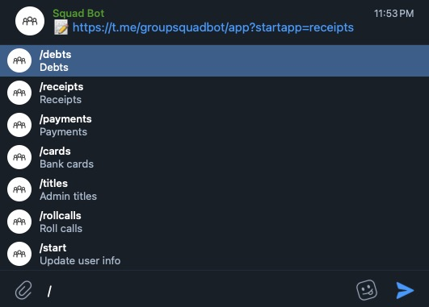

# Squad Bot

## Description

A powerful Telegram Bot for you and your friends.

Features:
- 🧾 Add receipts and payments
- 💵 Calculate debts
- 📢 Create customizable roll calls
- ✏️ Easily change titles in a group
- 💳 Quickly access your friends' credit card numbers

Supported locales: English.  
Other locales can be added by adding new files into `src/localization/locales`.

## Stack & tools
- Node.JS, PostgreSQL
- Telegraf, Express
- Mocha, Sinon, Chai
- Telegram Bot API

## Commands
- `npm run dev` – run bot locally
- `npm test` – run unit & integration tests
- `npm run umzug` – interact with database and migrations
